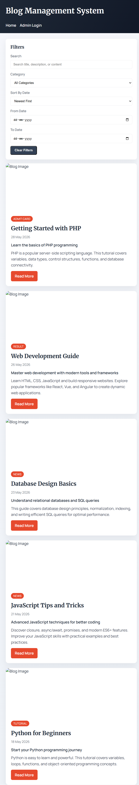
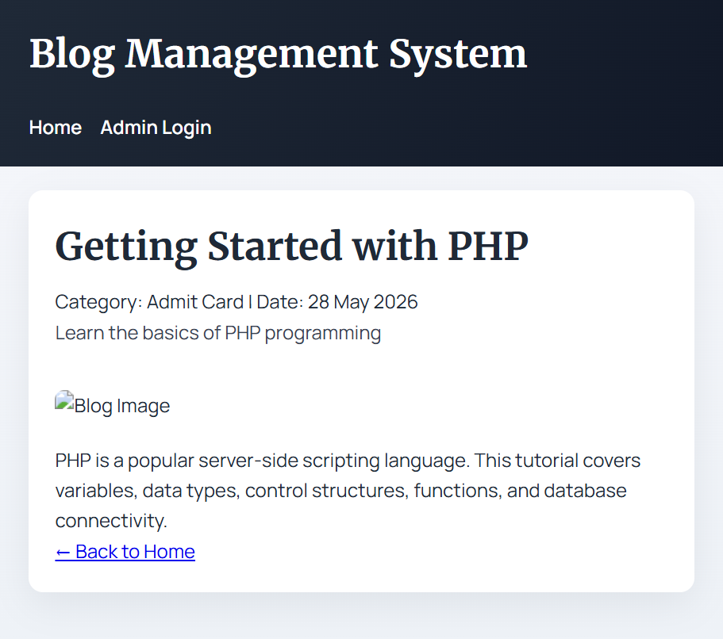
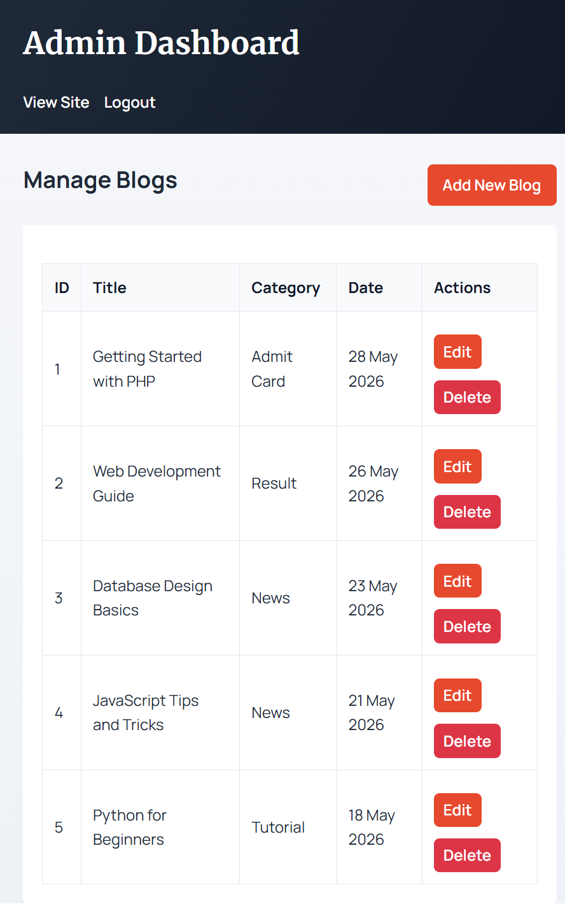
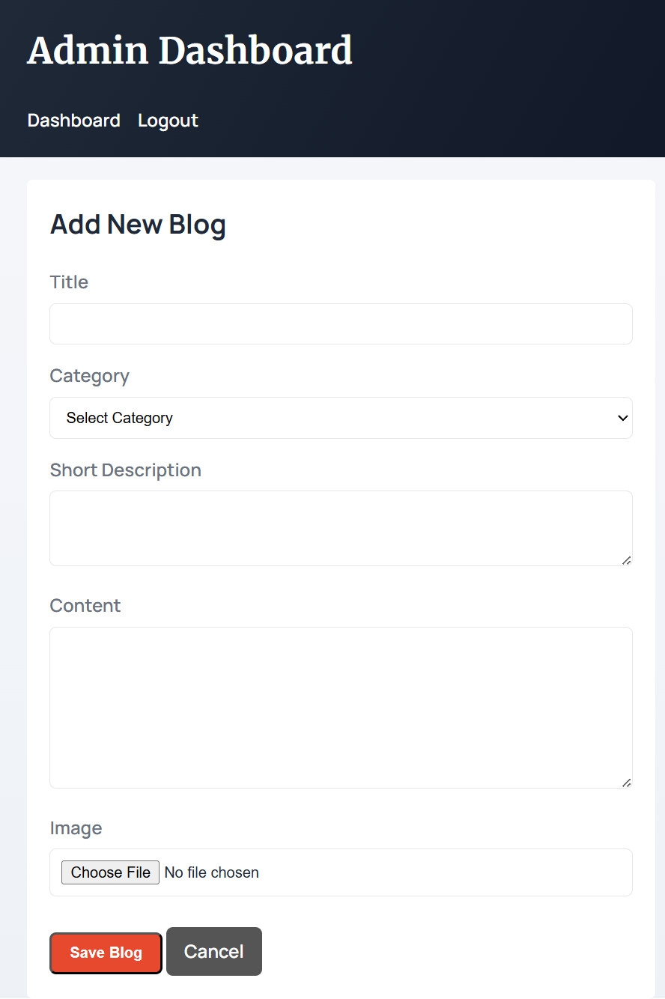

# 📝 Blog Management System (PHP + MySQL)

A clean, responsive blog management system with AJAX filtering and a simple admin panel. All blogs are fetched dynamically from MySQL, and filters work without page reloads. Perfect for managing and displaying blog content with real-time search and filtering capabilities.

## ✨ Features

### Frontend (User Side)
- ✅ Responsive blog listing page with dynamic content
- ✅ Individual blog detail pages with full content
- ✅ Real-time AJAX search (searches title, short description, and content)
- ✅ AJAX category filter (no page reload)
- ✅ Date range filtering (From Date to To Date)
- ✅ Sort by date (Newest First / Oldest First)
- ✅ Mobile-friendly and fully responsive design
- ✅ Clean, modern UI with smooth animations

### Admin Panel
- ✅ Secure admin login with password hashing
- ✅ Dashboard showing all blogs
- ✅ Add new blog (title, description, content, category, image)
- ✅ Edit existing blogs
- ✅ Delete blogs with confirmation
- ✅ Form validation and error handling
- ✅ Secure image upload with validation

## 🛠 Tech Stack
- **Backend**: PHP (Core - no frameworks)
- **Database**: MySQL/MariaDB
- **Frontend**: HTML5, CSS3 (Custom responsive design)
- **Interactivity**: jQuery + AJAX
- **Server Binaries**: Included (PHP 8.3, MariaDB 10.11)

---

## 🚀 How to Run Locally

### Prerequisites
- Windows OS (or Unix/Linux with slight modifications)
- No installation needed - everything is bundled!

### Step 1: Start MySQL Database

Open **PowerShell** and run:

```powershell
cd "d:\Inderjeet projects\blog management jobyaari\mariadb-10.11.8-winx64\bin"
& ".\mysqld.exe" --datadir="d:\Inderjeet projects\blog management jobyaari\mysql-data"
```

**Expected Output:**
```
2026-05-28 12:25:42 0 [Note] mysqld: ready for connections.
```

Keep this terminal open. Database is now running on `localhost:3306`.

### Step 2: Initialize Database (First Time Only)

Open another **PowerShell** and run:

```powershell
cd "d:\Inderjeet projects\blog management jobyaari"
Get-Content "blog_db.sql" | & "mariadb-10.11.8-winx64\bin\mysql.exe" -u root
```

This creates the database, tables, and inserts sample data.

### Step 3: Start PHP Server

Open a **new PowerShell** terminal and run:

```powershell
cd "d:\Inderjeet projects\blog management jobyaari"
& ".\php-bin\php.exe" -S localhost:8000 -t .
```

**Expected Output:**
```
[Thu May 28 12:25:13 2026] PHP 8.3.31 Development Server (http://localhost:8000) started
```

### Step 4: Access the Website

Open your browser and go to:

- **🏠 Home Page**: [http://localhost:8000](http://localhost:8000)
- **🔐 Admin Login**: [http://localhost:8000/admin/login.php](http://localhost:8000/admin/login.php)

---

## 🔑 Login Credentials

| Field | Value |
|-------|-------|
| **Admin URL** | `http://localhost:8000/admin/login.php` |
| **Username** | `admin` |
| **Password** | `password` |

---

## 📸 Screenshots

### 1. 🏠 Homepage - Blog Listing with Filters


The homepage displays all blogs in a clean card layout with a sidebar containing powerful filters:
- **Search Box**: Real-time search through title, description, and content (debounced with 300ms)
- **Category Filter**: Filter blogs by category (Admit Card, Result, News, Tutorial)
- **Date Sorting**: Sort by Newest First or Oldest First
- **Date Range**: Filter blogs between specific dates (From Date and To Date)
- **Clear Filters Button**: Reset all filters with one click
- Responsive layout that adapts to mobile, tablet, and desktop screens

---

### 2. 📖 Blog Detail Page


Shows the complete blog content with:
- Blog title prominently displayed
- Category and publication date
- Full blog image
- Complete blog content
- Back to Home navigation link
- Clean, readable typography with proper spacing

---

### 3. 🔐 Admin Login Page


Secure admin authentication interface featuring:
- Centered, clean login form
- Username field
- Password field
- Login button with red accent color
- Form validation on submission
- Session-based access control

**Default Credentials:**
- Username: `admin`
- Password: `password`

---

### 4. 📊 Admin Dashboard


Complete blog management dashboard showing:
- Table of all blogs with columns: ID, Title, Category, Date, Actions
- Edit button to modify any blog
- Delete button to remove blogs (with confirmation)
- Add New Blog button to create new content
- View Site link to preview frontend
- Logout functionality

---

### 5. ✍️ Add New Blog Form


Comprehensive form for creating blog posts:
- **Title**: Required field for blog title
- **Category**: Dropdown to select from predefined categories
- **Short Description**: Brief summary shown in blog listings
- **Content**: Full blog content with rich text support
- **Image**: Optional image upload (JPG, PNG, GIF, WebP supported)
- **Validation**: All required fields are validated before saving
- **File Size Limit**: Images limited to 2MB for performance
- Save and Cancel buttons for form actions

---

## 📁 Project Structure

```
blog-management-jobyaari/
├── index.php                    # Home page with blog listing
├── blog.php                     # Individual blog detail page
├── fetch_blogs.php              # AJAX endpoint for filtering blogs
├── db.php                       # Database connection
├── blog_db.sql                  # Database schema & initial data
│
├── assets/
│   ├── css/
│   │   └── style.css           # All styling (responsive design)
│   ├── js/
│   │   └── script.js           # AJAX filtering logic
│   └── img/                    # Image folder
│
├── admin/
│   ├── index.php               # Admin dashboard (list blogs)
│   ├── login.php               # Admin login page
│   ├── add.php                 # Add new blog form
│   ├── edit.php                # Edit existing blog
│   ├── delete.php              # Delete blog
│   ├── logout.php              # Logout handler
│   └── upload_utils.php        # Image upload validation
│
├── uploads/                    # Uploaded blog images
├── php-bin/                    # PHP 8.3 executable
├── mariadb-10.11.8-winx64/    # MariaDB binaries
├── mysql-data/                 # Database files
├── .gitignore                  # Git ignore rules
└── README.md                   # This file
```

---

## 🔧 Database Credentials

**Location**: [db.php](db.php)

```php
$host = 'localhost';          // MySQL host
$dbname = 'blog_db';          // Database name
$user = 'root';               // Username (no password by default)
$pass = '';                   // Password (empty)
```

To change credentials, update this file with your actual database details.

---

## 🔍 Key Features Explained

### AJAX Filtering
- All filters work without page reload using jQuery AJAX
- Search is debounced (300ms delay) to reduce server load
- Category filter instantly shows matching blogs
- Date sorting changes order immediately

### Database Schema
```sql
CREATE TABLE users (
  id INT PRIMARY KEY,
  username VARCHAR(50),
  password VARCHAR(255)
);

CREATE TABLE categories (
  id INT PRIMARY KEY,
  name VARCHAR(100)
);

CREATE TABLE blogs (
  id INT PRIMARY KEY,
  title VARCHAR(255),
  short_description TEXT,
  content LONGTEXT,
  category_id INT,
  image VARCHAR(255),
  created_at TIMESTAMP
);
```

### Admin Features
- **Password Hashing**: Uses BCrypt for secure password storage
- **Session Management**: Sessions used for admin authentication
- **Image Validation**: Validates file type and size before upload
- **Form Validation**: Server-side validation for all form inputs

---

## 🌐 Deployment to Free Hosting

### Option 1: InfinityFree

1. Sign up at [InfinityFree.net](https://www.infinityfree.net)
2. Create an account and activate hosting
3. Go to **File Manager** → `public_html`
4. Upload all files EXCEPT:
   - `php-bin/` folder
   - `mariadb-10.11.8-winx64/` folder
   - `mysql-data/` folder
5. In **Hosting Control Panel** → **MySQL Databases**:
   - Create new database (e.g., `blog_db`)
   - Note the username and password
6. Import `blog_db.sql` using phpMyAdmin
7. Update [db.php](db.php) with hosting credentials:
   ```php
   $host = 'provided-by-hosting';
   $dbname = 'account_blogdb';
   $user = 'account_user';
   $pass = 'your-password';
   ```
8. Ensure `uploads/` folder exists and is writable
9. Access your live site: `https://your-domain.infinityfree.net`

### Option 2: 000webhost

Similar process to InfinityFree - follow their documentation.

### Option 3: Render (Recommended for modern apps)

1. Sign up at [Render.com](https://render.com)
2. Connect your GitHub repository
3. Create new Web Service
4. Configure build command and start command
5. Deploy to live URL

---

## 📝 Database Initialization

The project includes `blog_db.sql` with:

- **Users Table**: Pre-configured admin user
  - Username: `admin`
  - Password: Hashed password for `password`

- **Categories Table**: Pre-populated with:
  - Admit Card
  - Result
  - News
  - Tutorial

- **Blogs Table**: Empty (ready for content)

**To reset database** (if something goes wrong):

```powershell
cd "d:\Inderjeet projects\blog management jobyaari"

# Drop and recreate
& "mariadb-10.11.8-winx64\bin\mysql.exe" -u root -e "DROP DATABASE IF EXISTS blog_db; CREATE DATABASE blog_db;"

# Import fresh schema
Get-Content "blog_db.sql" | & "mariadb-10.11.8-winx64\bin\mysql.exe" -u root
```

---

## ⚙️ Configuration Files

### [db.php](db.php) - Database Configuration
```php
$host = 'localhost';          // Change for remote database
$dbname = 'blog_db';          // Change database name if needed
$user = 'root';               // Change username
$pass = '';                   // Add password if needed
```

### [.gitignore](.gitignore) - Git Ignore Rules
```
/mariadb-*/                   # Exclude MariaDB binaries
/mysql-data/                  # Exclude database files
/php-bin/                     # Exclude PHP executable
/uploads/*                    # Exclude uploaded images (keep folder)
```

---

## 🐛 Troubleshooting

### **Database Connection Error**
- ✅ Make sure MySQL server is running (see Step 1)
- ✅ Check credentials in [db.php](db.php)
- ✅ Ensure port 3306 is available

### **Blogs Not Displaying**
- ✅ Verify database is initialized (see Step 2)
- ✅ Check database has `blog_db` and tables exist
- ✅ Verify [db.php](db.php) credentials are correct

### **Admin Login Not Working**
- ✅ Check username is `admin` (case-sensitive)
- ✅ Check password is `password` (no typos)
- ✅ Clear browser cookies and try again

### **Uploads Not Working**
- ✅ Ensure `uploads/` folder exists
- ✅ Check folder permissions (should be writable)
- ✅ Verify image file size is under 2MB
- ✅ Only JPG, PNG, GIF, WEBP allowed

### **Port 8000 Already in Use**
```powershell
& ".\php-bin\php.exe" -S localhost:8001 -t .  # Use port 8001 instead
```

---

## 📋 Submission Checklist

- [ ] Update [README.md](README.md) with your actual GitHub and live URLs
- [ ] Change admin password in database (if desired)
- [ ] Test all features locally
- [ ] Push code to GitHub
- [ ] Deploy to free hosting
- [ ] Verify live website is responsive (mobile + desktop)
- [ ] Test admin login on live server
- [ ] Test adding, editing, deleting blogs
- [ ] Verify AJAX filters work without page reload
- [ ] Submit GitHub link and live site link

---

## 📞 Support

For issues or questions:
1. Check the [Troubleshooting](#-troubleshooting) section
2. Review configuration files
3. Check browser console for JavaScript errors (F12)
4. Check PHP error logs if available

---

## 📄 License

This project is open source and available for educational purposes.

---

**Built with ❤️ for the Blog Management System Assignment**